= Laptop As Code
:icons: font
:source-highlighter: highlightjs

A stateless computer

== Summary
* Laptop As Code?
* Bash
* Ansible
* Laptop As Code with Ansible (& Demo)

== Who am I?
Mehdi Rebiai::
* icon:github[] https://github.com/mrebiai
* icon:envelope[] mehdi.rebiai.dev@gmail.com
* Techlead & Data engineer at Lectra (https://www.lectra.com)
 since 2018
* Dev since 2004 

== Laptop As Code?
image::images/code.gif[]

=== Once upon a time...
You have a new laptop

🎉 💻 🥳 🥰

=== ... and then...
* Some installations... 🧰 ⚒️
* Some customizations... 🔧 🦄
* And sometimes... 🥵

=== ... and one day 🔥 !

Or lost, stolen, broken, ...

=== ... finally
Solution 🪄 => Documentation about installation

=== ... but
* My personal documents / configurations ?
* Is the documentation up-to-date ? 🤣
* Any fresh installation (new incomer/computer) = documentation + 🥵 ?

=== Another point of view (1/2)
Your laptop deserves the same attention as your production code !

=== Another point of view (2/2)

=== A computer is stateless !
* (Almost) Everything as Code in SCM

image:images/git-logo.png[width=150]

* Otherwise => Cloud storage

image:images/onedrive-logo.png[width=150] image:images/google-docs.jpg[width=150]

=== And my passwords 😱 ?
* Keepass file in SCM
* Lastpass, 1Password, ...

=== My new challenge : rebuild my 💻 in 30 minutes !

image::images/challenge.gif[width=350]

NOTE: OS already installed

== Bash
image::images/press-any-key.gif[]

=== `my-env/run.sh` image:images/bash-logo.jpg[width=100]
[source, bash]
----
install() {
  installCommon
  installSDK
  installGit
  installDocker
  installKubernetes
  ...
  # TODO To be continued
}
installCommon() {
  ...
  sudo apt -y install git graphviz gimp curl git-gui aspell-fr openssh-server filezilla nodejs npm wget pdfshuffler tree gtk-recordmydesktop terminator ethtool jq snapdi tig kakoune ranger httpie ffmpeg keepassxc
  # TODO To be continued
}
...
----

=== `my-env/run.sh` workflow

[.columns]
=== A good scripting?

[.column]

[.column]
But::
* Many SCM forks & customization
* Maintainability ?

=== New challenge(s)
* Shareable scripting
* Easy customization
* Readable configuration
* Do you know Ansible?

== Ansible
image::images/magic.gif[]

:nb-ansible-slides: 9

=== Ansible (1/{nb-ansible-slides})
.https://docs.ansible.com/[^]
[quote]
----
Ansible automates the management of remote systems and controls their desired state
----

* Infra As Code & Idempotency
* Open Source : https://www.ansible.com/[^]
* Red Hat Ansible Automation Platform

[.columns]
=== Ansible (2/{nb-ansible-slides})

[.column]
image::images/ansible-basic.svg[width=400]

[.column]
* Ansible on Control node
* Python on Managed Nodes
* Inventory YAML or INI
* SSH connections
* YAML task description
* Multi-OS

=== Ansible (3/{nb-ansible-slides})
.Inventory
[source,ini]
----
[webservers]
node1.example.com
node2.example.com

[dbservers]
node3.example.com
----

=== Ansible (4/{nb-ansible-slides})
.`ansible-playbook playbook.yml`
[source,yaml]
----
---
- name: Update web servers
  hosts: webservers
  remote_user: root
  tasks:
  - name: Ensure apache is at the latest version
    tags: httpd
    ansible.builtin.yum:
      name: httpd
      state: latest
  - name: Write the apache config file
    tags: httpd
    ansible.builtin.template:
      src: /srv/httpd.j2
      dest: /etc/httpd.conf

- name: Update db servers
  hosts: dbservers
  remote_user: root
  tasks:
  - name: Ensure postgresql is at the latest version
    tags: pg
    ansible.builtin.yum:
      name: postgresql
      state: latest
  - name: Ensure that postgresql is started
    tags: pg
    ansible.builtin.service:
      name: postgresql
      state: started
----

=== Ansible (5/{nb-ansible-slides})
* A *Task* calls a *Module* (yum, apt, service...) => https://docs.ansible.com/ansible/latest/collections/ansible/builtin/index.html[Built-In index] 
* Every *Task* can contain *Tag(s)*
* Some *Tasks* can be defined in *Roles*
* A *Playbook* can call *Tasks* and/or *Roles*

=== Ansible (6/{nb-ansible-slides})
Ansible Galaxy::
* A tool : `ansible-galaxy` : role management
* A public Hub for Roles : https://galaxy.ansible.com/

NOTE: The Hub is not mandatory!

=== Ansible (7/{nb-ansible-slides})
.Role
----
tasks/
  main.yml     #  <-- tasks file can include smaller files if warranted
handlers/      #
  main.yml     #  <-- handlers file
templates/     #  <-- files for use with the template resource
  ntp.conf.j2  #  <-- templates end in .j2
files/         #
  bar.txt      #  <-- files for use with the copy resource
  foo.sh       #  <-- script files for use with the script resource
vars/          #
  main.yml     #  <-- variables associated with this role
defaults/      #
  main.yml     #  <-- default lower priority variables for this role
meta/          #
  main.yml     #  <-- role dependencies
----

=== Ansible (8/{nb-ansible-slides})
Laptop As Code with Ansible::
* `127.0.0.1` in Inventory
* Ansible local connection
* `ansible-pull -U <giturl> ...` =
** `git clone/pull ...` +
** `ansible-playbook ...`

=== Ansible (9/{nb-ansible-slides})
*Laptop As Code with Ansible*

=== Sources - LearnLinuxTV
* Getting started with Ansible in 16 videos : https://www.youtube.com/playlist?list=PLT98CRl2KxKEUHie1m24-wkyHpEsa4Y70[^]
* Ansible for laptop/desktop : https://youtu.be/gIDywsGBqf4[^]

== Laptop As Code with Ansible

Step by step... with a demo 🤞

=== Step 1 - Add a bootstrap (1/2)
* SSH & Git configuration
* Ansible installation
* Inventory creation, having some environment variables (asking some questions...)

=== Step 1 - Add a bootstrap (2/2)

=== Step 2 - A Playbook... but without external Roles
* Shareable scripting ✅
* Easy customization ❌
* Readable configuration ✅

=== Step 3 - A Playbook... but with external Roles
* Shareable scripting ✅
* Easy customization ✅
* Readable configuration ✅

What strategy for external Roles 🤔 ? +++ +++ How to keep a unique Playbook 🤔🤔 ?

=== Wait a minute, I need a concrete example
 

[.columns]
=== Scenario - 3 users
:avatar-width: 100

[.columns]
*Alice* +++ +++  +++ +++ backend +++ +++ developer

[.columns]
*Bob* +++ +++ image:images/bob.png[width={avatar-width}] +++ +++ employee?

[.columns]
*Carol* +++ +++ image:images/carol.jpg[width={avatar-width}] +++ +++ full stack +++ +++ developer

=== Role Strategy

=== 🎉 Demo 🥳

🍀 🤞

=== Lectra example (today)
TODO

== Thank you ! 

Questions?

https://github.com/mrebiai/laptop-as-code
